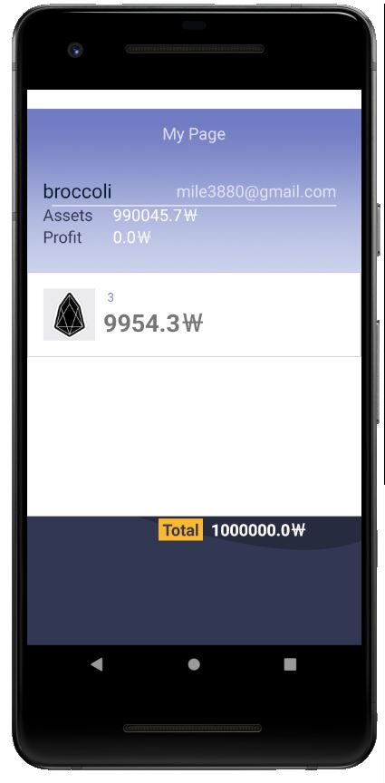

# To Be B.
주식 투자로 큰 성공을 누리신 B 씨가 되기 위해 노력하는 당신!
당신을 위해 만든 모의 주식 투자 어플입니다.

### 개발 스택
- Android
- Firebase
- Node.js

---

- [CryptoCompare](https://www.cryptocompare.com/) 라는 해외 가상화폐 사이트의 실시간 가격 정보 API를 사용했습니다.
- 현재 실시간 서버를 닫아놓은 상태이기 때문에 암호화폐 가격은 변동이 없는 상태입니다.
- 서버를 열어두면 아래와 같이 동작합니다.

### 회원가입 및 로그인

### 권한 요청

### 메인 화면

### 암호 화폐를 선택하여 시세 확인 및 매도&매수

### 실시간 가격 확인

### 마이페이지

### 기본금 100만원에서 시작해 최종 손익 합계는 "Total"로 보여줍니다.

### 수익을 얻은 모습입니다.

